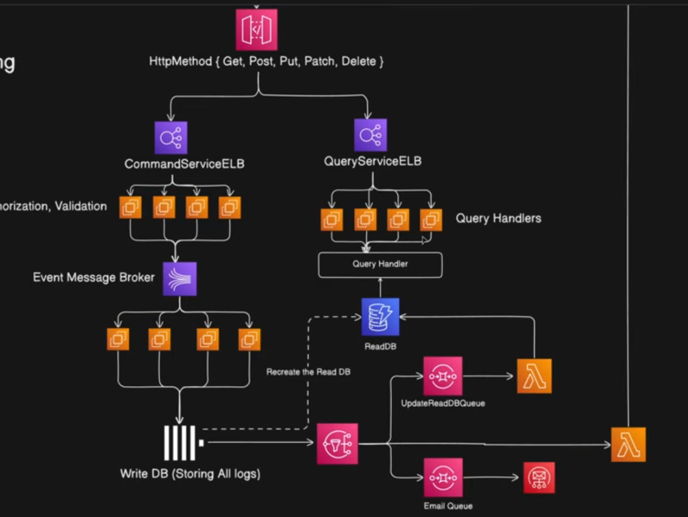

# ⚡ System Design #4: CQRS Pattern (Command Query Responsibility Segregation)
*(Notes from Piyush Garg System Design Series - Part 4)*

> **Core Philosophy**: Application me **Data Write (Commands)** aur **Data Read (Queries)** ka kaam aur load bilkul alag hota hai. Dono ko alag-alag model, alag service, aur alag database me baant do!

---

## 🎯 1. What is CQRS?

**CQRS** stands for **Command Query Responsibility Segregation**:

```text
               ┌──► [ Command Service ] ──► [ Write DB (Postgres / SQL) ]
               │    (POST, PUT, DELETE)           │
[ User Request ]                                  ▼ (Async Event Sync via Kafka)
               │                                  │
               └──► [ Query Service ]   ──► [ Read DB (Elastic / Redis / Mongo) ]
                    (GET Requests)
```

1. **Commands (Mutations)**:
   - Data create, update, ya delete karne wale operations (`POST`, `PUT`, `DELETE`).
   - Sirf business logic validate karke state mutate karta hai.
2. **Queries (Reads)**:
   - Data fetch karne wale operations (`GET`).
   - Isme koi state mutation ya side-effects nahi hote.

---

## ❓ 2. Why do we need CQRS? (The Real Problem)

Modern apps (Instagram, Twitter, E-commerce) me Read vs Write traffic **drastically asymmetric** hota hai:

```text
Read Operations (99%)  ████████████████████████████████████████
Write Operations (1%)  █
```

### 🔴 The Monolithic DB Bottleneck:
Agar ek hi database aur ek hi model dono handle karega:
- Heavy complex search/filter queries run karne par DB lock ho jayega, jisse new orders (writes) fail hone lagenge.
- Write database ko Normalized hona padta hai (taaki duplicate na ho), par Read queries ke liye Denormalized (JOIN-free) data chahiye hota hai.

---

## 🏗️ 3. Production Architecture of CQRS

Piyush Garg video me explain karte hain ki production me CQRS kaise implement hota hai:

### 1️⃣ Intelligent Routing with Load Balancers (ELB / Nginx)
Load Balancer HTTP methods dekh kar traffic alag microservices par route karta hai:
* `POST /orders` ➔ **Command Microservice**
* `GET /orders/:id` ➔ **Query Microservice** (Horizontally scaled with 10+ EC2 instances!)

### 2️⃣ Optimized Databases for Both Sides:
* **Write Database**: Strongly consistent, relational DB (PostgreSQL / MySQL) ya Event Store (ACID compliance ke liye).
* **Read Database**: Denormalized, blazing fast search engine (Elasticsearch, MongoDB, ya Redis Cache) jisme complex SQL JOINs ki zaroorat nahi padti!

### 3️⃣ Asynchronous Data Sync (Eventual Consistency):
Jab Command DB me naya order likha jata hai, wo background me **Kafka / RabbitMQ / SQS** event emit karta hai ➔ Read DB async update ho jati hai.

---

## ⚖️ 4. The Big Trade-Off: Eventual Consistency

CQRS ka sabse bada compromise **Eventual Consistency** hota hai:

* **What happens?**: Command likhne aur Read DB sync hone ke beech me **100ms – 500ms** ka chota sa gap ho sakta hai.
* **Kab chalega? (Safe)**: Social media likes, YouTube views, Swiggy order status updates me 1 second ka delay bilkul normal hai.
* **Kab NAHI chalega? (Dangerous)**: Stock Trading (Zerodha) ya Forex systems me jahan har microsecond par accurate stock price strict honi chahiye!

---

## 📊 Summary: When to Use vs When to Avoid

| Situation | Should You Use CQRS? | Reason |
| :--- | :---: | :--- |
| **High Read-to-Write Ratio (e.g. 100:1)** | ✅ YES | Query side ko independently 10x scale kar sakte ho |
| **Complex Search & Analytics Needs** | ✅ YES | Read side me Elasticsearch use kar sakte ho |
| **Simple CRUD App (Low Traffic)** | ❌ NO | Over-engineering! Codebase and infra complexity 2x ho jayegi |
| **Strict Instant Consistency Required** | ❌ NO | Eventual consistency delay business logic break kar sakta hai |

---

## 💡 Key Architectural Takeaway

> **Event Sourcing** and **CQRS** are best friends! Event Sourcing write operations ko immutable log me rakhta hai (Command side), aur CQRS un events se clean read-views banakar fast queries serve karta hai (Query side).

---

## 🖼️ 5. Complete Production Architecture Diagram



### 🔍 Architecture Flow Breakdown (From Diagram):
1. **API Gateway**: HTTP Methods ke basis par traffic bifurcate karta hai (`GET` vs `POST, PUT, PATCH, DELETE`).
2. **Write / Command Path**:
   - **`CommandServiceELB`** requests ko Command Worker EC2 instances par bhejta hai (Validation & Authorization).
   - Tasks **Event Message Broker** ke through pass hote hain aur **Write DB (Append-only logs)** me save hote hain.
   - SNS / SQS Queues (`UpdateReadDBQueue`, `EmailQueue`) aur Lambda functions asynchronous processing trigger karte hain.
3. **Read / Query Path**:
   - **`QueryServiceELB`** incoming read traffic ko horizontally scaled **Query Handlers** me distribute karta hai.
   - Direct **Read DB** se high-speed data fetch hota hai.
   - 🔄 **Recreate the Read DB**: Agar Read DB kabhi corrupt ya crash ho jaye, to Write DB ke saare historical logs replay karke pura Read DB scratch se dobara generate kiya ja sakta hai!


