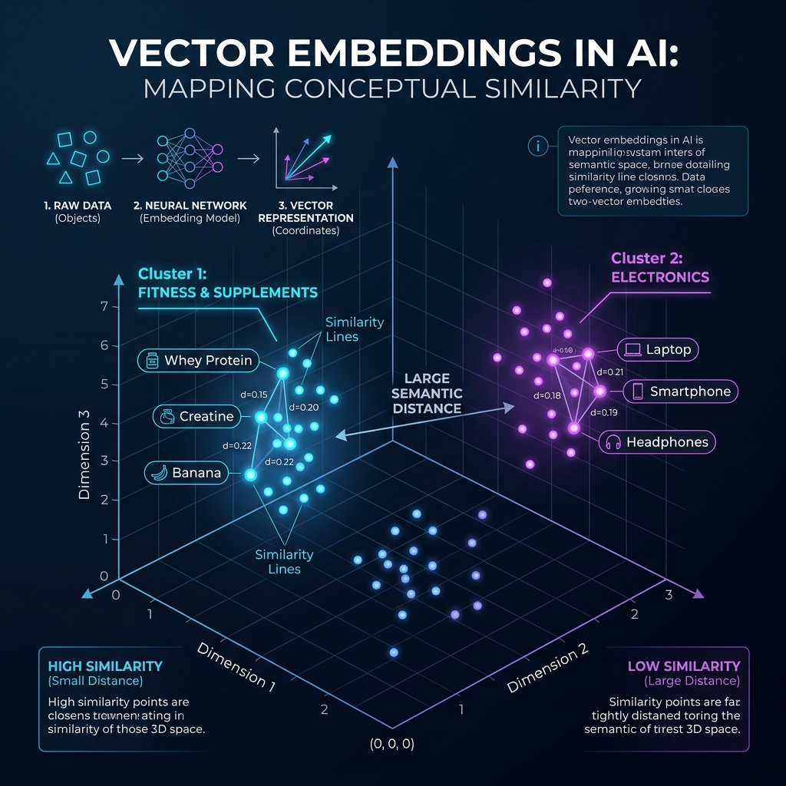

# 🧠 AI Day 4 — What are Vectors, Vector Embeddings & Vector Databases (The Brain of Modern AI)
> **Video Resource**: [What are Vectors \| Vector Embedding and Vector Database \| GenAI Full Course #6](https://youtu.be/JsGwjwnl4hY) | **Instructor**: Rohit Negi | **Series**: AI & GenAI Mastery

---

## 🗂️ Table of Contents

| # | Topic | Key Concepts |
|---|-------|--------------|
| 1 | **The Recommendation Dilemma in Traditional Tech** | Graph & Matrix approach, Cold Start problem, Zero semantic intelligence |
| 2 | **What is a Vector? (Physics vs Computer Science)** | Physical arrow vs High-dimensional float array coordinates |
| 3 | **Vector Embeddings: Capturing Human Meaning in Numbers** | The Gym Supplement Case Study (Protein, Creatine, Banana vs Electronics) |
| 4 | **Visualizing Semantic Vector Space** | High-dimensional geometric clusters & distance projections |
| 5 | **Vector Distance & Similarity Mathematics** | Cosine Similarity ($\cos\theta$), Euclidean Distance ($L_2$), Dot Product |
| 6 | **Why Relational Databases (B-Trees) Fail for AI** | 1D scalar indexing vs 1536-dimensional search, Curse of Dimensionality |
| 7 | **Vector Databases & ANN Indexing** | Pinecone, ChromaDB, Qdrant, pgvector; Exact Scan vs HNSW & IVFFlat |
| 8 | **Hands-On Python Code: Building a Product Recommendation Engine** | Google GenAI SDK (`text-embedding-004`), Vector Math & Top-$K$ Search |
| 9 | **Production Cheatsheet & Mental Models** | Essential formulas, dimensions reference, and system design takeaways |

---

## 1️⃣ The Recommendation Dilemma in Traditional Computing

> 💡 **The Problem**: Amazon, YouTube, and Netflix need to recommend relevant items to users. How did old-school computer algorithms try to solve this before AI embeddings?

```
                 ❌ TRADITIONAL GRAPH / CO-OCCURRENCE MATRIX:

                  Users ──► Purchased Product A (Whey Protein)
                  Users ──► ALSO Purchased Product B (Shaker Bottle)
                  Graph Edge Created: [Protein ──connects──► Shaker]
```

### 💥 Why Traditional Systems Fail:

```
┌─────────────────────────────────────────────────────────────────────────────┐
│                    THE 3 CRITICAL LIMITATIONS OF OLD SYSTEMS                │
├──────────────────────────┬──────────────────────────────────────────────────┤
│ 1. The Cold-Start Crisis │ Jab koi naya product launch hota hai (0 buyers), │
│                          │ graph me koi edge nahi hoti ➔ Wo kabhi recommend │
│                          │ nahi ho pata!                                    │
├──────────────────────────┼──────────────────────────────────────────────────┤
│ 2. Matrix Explosion      │ 10 Million Users × 50 Million Products           │
│                          │ = $5 \times 10^{14}$ sparse matrix elements!     │
│                          │ 99.99% matrix empty hoti hai (Huge RAM waste).   │
├──────────────────────────┼──────────────────────────────────────────────────┤
│ 3. Zero Semantic Sense   │ Algorithm ko pata hi nahi ki "Whey Protein",     │
│                          │ "BCAA", aur "Banana" teeno Fitness & Nutrition   │
│                          │ category ko belong karte hain!                   │
└──────────────────────────┴──────────────────────────────────────────────────┘
```

---

## 2️⃣ What is a Vector? (Physics vs Computer Science)

```
       PHYSICS DEFINITION                       COMPUTER SCIENCE DEFINITION
   ┌───────────────────────────┐               ┌───────────────────────────┐
   │ An entity with:           │               │ An ordered list of $N$    │
   │ 1. Magnitude (Length)     │               │ Floating-Point Numbers    │
   │ 2. Direction (Angle)      │               │ representing coordinates  │
   │                           │               │ in $N$-dimensional space. │
   └─────────────┬─────────────┘               └─────────────┬─────────────┘
                 │                                           │
                 ▼                                           ▼
             ↗ (5 m/s, 45°)                     [ 0.85, -0.12, 0.44, 0.91 ]
```

---

## 3️⃣ Vector Embeddings: Capturing Human Meaning in Numbers

> 💡 **What is an Embedding?** Text, Images, ya Products ko ek multi-dimensional numerical vector me map karna, jahan **similar concepts geometric space me paas-paas hote hain**.

### 🏋️‍♂️ The Gym Supplement & E-Commerce Case Study:

Maan lo hum 4 feature dimensions define karte hain ($0.0 \to 1.0$ scale pe):
- **Dim 1**: Fitness & Gym relevance
- **Dim 2**: Price ($0 = \text{Cheap}, 1 = \text{Expensive}$)
- **Dim 3**: Edible / Nutrition ($1 = \text{Food/Supplement}, 0 = \text{Hardware}$)
- **Dim 4**: Electronics & Gadget

```
┌─────────────────────────┬──────────────┬──────────────┬──────────────┬──────────────┐
│ Product Name            │ Dim 1 (Gym)  │ Dim 2 (Price)│ Dim 3 (Food) │ Dim 4 (Tech) │
├─────────────────────────┼──────────────┼──────────────┼──────────────┼──────────────┤
│ 🥛 Whey Protein Powder  │     0.95     │     0.80     │     0.90     │     0.02     │
│ ⚡ Creatine Monohydrate │     0.92     │     0.40     │     0.95     │     0.01     │
│ 🍌 Fresh Banana         │     0.85     │     0.05     │     1.00     │     0.00     │
│ 💻 MacBook Pro M3       │     0.05     │     0.98     │     0.00     │     0.99     │
│ 🎧 Sony WH-1000XM5      │     0.15     │     0.75     │     0.00     │     0.95     │
└─────────────────────────┴──────────────┴──────────────┴──────────────┴──────────────┘
```

> 🎯 **Magical Insight**:
> - `Whey Protein` aur `Creatine` ke coordinates lagbhag same hain ➔ **Super Close Distance**!
> - `Banana` sasta hai, par Gym + Nutrition features match hone ke karan supplement cluster ke paas hai!
> - `MacBook` aur `Sony Headphones` alag tech cluster me hain ➔ **Large Semantic Distance**!

---

## 4️⃣ Visualizing Semantic Vector Space



```
                         HIGH-DIMENSIONAL CLUSTER MAP (2D Projection):
                                      ▲
                                      │   [Cluster 1: Fitness & Nutrition]
                                      │   • Whey Protein (0.95, 0.90)
                                      │   • Creatine (0.92, 0.95)
                                      │   • Banana (0.85, 1.00)
                                      │
                                      │
   [Cluster 2: Electronics]           │
   • MacBook Pro (0.05, 0.00)         │
   • Sony Headphones (0.15, 0.00)     │
                                      └────────────────────────────────────────►
```

---

## 5️⃣ Vector Distance & Similarity Mathematics

Jab user search karta hai *"Post-workout muscle recovery"*, hum query ka vector banate hain aur database me maujood vectors se compare karte hain using **3 Mathematical Formulas**:

```
┌─────────────────────────────────────────────────────────────────────────────┐
│                       VECTOR SIMILARITY FORMULAS MATRIX                     │
├────────────────────────┬────────────────────────────┬───────────────────────┤
│ Metric Name            │ Mathematical Formula       │ What it Measures      │
├────────────────────────┼────────────────────────────┼───────────────────────┤
│ 1. Cosine Similarity   │ $\cos(\theta) = \frac{A \cdot B}{\|A\| \|B\|}$│ **Angle/Direction**   │
│                        │                            │ (Length doesn't matter│
├────────────────────────┼────────────────────────────┼───────────────────────┤
│ 2. Euclidean ($L_2$)   │ $d = \sqrt{\sum (A_i - B_i)^2}$ │ **Straight line**     │
│                        │                            │ physical distance     │
├────────────────────────┼────────────────────────────┼───────────────────────┤
│ 3. Dot Product         │ $A \cdot B = \sum A_i B_i$ │ **Direction + Length**│
│                        │                            │ (Fastest if norm = 1) │
└────────────────────────┴────────────────────────────┴───────────────────────┘
```

```
       Euclidean Distance (L2)                     Cosine Similarity (cos θ)
   Shortest physical line between points         Angle between vector directions
             ▲                                            ▲
             │       B                                    │       /  B
             │      /|                                    │      / θ
             │     / |                                    │     /____ A
             │    /  | d(A,B)                             │    /
             │   /   |                                    │   /
             └──A────┴────►                               └──┴──────────►
```

### 📐 Step-by-Step Numerical Example:
Let Vector $A = [1, 2]$ and Vector $B = [2, 3]$:

1. **Dot Product**: $(1 \times 2) + (2 \times 3) = 2 + 6 = 8$
2. **Magnitude $\|A\|$**: $\sqrt{1^2 + 2^2} = \sqrt{5} \approx 2.236$
3. **Magnitude $\|B\|$**: $\sqrt{2^2 + 3^2} = \sqrt{13} \approx 3.605$
4. **Cosine Similarity**: $\frac{8}{2.236 \times 3.605} = \frac{8}{8.06} \approx \mathbf{0.992}$ (99.2% Similar! 🎉)
5. **Cosine Distance**: $1 - 0.992 = \mathbf{0.008}$ (Tiny distance = closely related)

---

## 6️⃣ Why Relational Databases (B-Trees) Fail for AI

```
                      B-TREE INDEX (1-Dimensional):
  Works on single linear scale: [ 10 ➔ 20 ➔ 30 ➔ 40 ➔ 50 ]
  Can easily answer: `WHERE age > 25` in $O(\log N)$ time.
  
                      HIGH-DIMENSIONAL VECTOR SPACE (1536-D):
  [ 0.12, -0.45, 0.89, 0.02, 0.77, ... 1536 floating numbers ]
  ❌ There is NO "left" or "right" in 1536 dimensions!
  ❌ B-Tree Index fails completely ➔ Drops to full table scan $O(N)$!
```

> ⚠️ **The Curse of Dimensionality**: High dimensions me har vector ek dusre se equidistant lagne lagta hai, isliye specialized multidimensional graph data structures ki zaroorat padti hai.

---

## 7️⃣ Vector Databases & ANN Indexing

```
┌─────────────────────────────────────────────────────────────────────────────┐
│                    POPULAR VECTOR DATABASES IN INDUSTRY                     │
├──────────────────────────┬──────────────────────────────────────────────────┤
│ 1. pgvector (PostgreSQL) │ Relational data + Vector search in single DB.    │
├──────────────────────────┼──────────────────────────────────────────────────┤
│ 2. ChromaDB              │ Lightweight, open-source embedded vector DB.     │
├──────────────────────────┼──────────────────────────────────────────────────┤
│ 3. Pinecone              │ Fully managed, serverless cloud vector database. │
├──────────────────────────┼──────────────────────────────────────────────────┤
│ 4. Qdrant / Milvus       │ Ultra-high performance rust/distributed engine.  │
└──────────────────────────┴──────────────────────────────────────────────────┘
```

```
                          ANN INDEXING ALGORITHMS:
                          
  1. Flat Index (Brute Force):
     • Compares query with every single row. 100% recall, but $O(N)$ slow.

  2. IVFFlat (Inverted File Index):
     • Clusters space into Voronoi cells using k-Means. Fast, low memory.

  3. HNSW (Hierarchical Navigable Small World):
     • Industry Gold Standard! Multi-layer skip-list graph.
     • Sub-millisecond search latency across 10+ Million vectors! ⚡
```

---

## 8️⃣ Hands-On Python Code: Building a Semantic Recommendation Engine

> 🛒 Ab hum Google GenAI Embedding model se real products ke vectors generate karenge aur Cosine Similarity se top recommendations nikalenge!

### 📦 Step 1: Install SDK
```bash
pip install google-genai numpy python-dotenv
```

---

### 💻 Step 2: Complete Recommendation Engine Script

```python
import os
import numpy as np
from google import genai
from dotenv import load_dotenv

load_dotenv()
client = genai.Client(api_key=os.getenv("GEMINI_API_KEY"))

# 1. Product Catalog (E-Commerce Store)
products = [
    {"id": 1, "title": "Optimum Nutrition Gold Standard 100% Whey Protein Powder", "category": "Supplements"},
    {"id": 2, "title": "MuscleBlaze Micronized Creatine Monohydrate Powder",        "category": "Supplements"},
    {"id": 3, "title": "Fresh Organic Robust Bananas (1 Dozen)",                   "category": "Groceries"},
    {"id": 4, "title": "Apple MacBook Pro 16-inch M3 Max Chip",                    "category": "Electronics"},
    {"id": 5, "title": "Sony WH-1000XM5 Wireless Noise Cancelling Headphones",     "category": "Electronics"},
    {"id": 6, "title": "Nike Air Zoom Pegasus Running Shoes for Men",              "category": "Footwear"},
    {"id": 7, "title": "Stainless Steel Gym Protein Shaker Bottle 700ml",          "category": "Fitness Gear"},
]

# 2. Function to generate vector embedding via Gemini API
def get_embedding(text: str) -> list[float]:
    """Generates 768-dimensional float embedding vector."""
    response = client.models.embed_content(
        model="text-embedding-004",
        contents=text
    )
    return response.embeddings[0].values

# 3. Mathematical Cosine Similarity Function
def cosine_similarity(vec_a: list[float], vec_b: list[float]) -> float:
    a = np.array(vec_a)
    b = np.array(vec_b)
    return float(np.dot(a, b) / (np.linalg.norm(a) * np.linalg.norm(b)))

print("🔄 Generating embeddings for product catalog...")
for product in products:
    product["embedding"] = get_embedding(product["title"])
print(f"✅ Generated embeddings for {len(products)} products (768 dimensions each)!\n")

# 4. Search Function (Find Top-K Most Similar Products)
def recommend_products(user_query: str, top_k: int = 3):
    print("=" * 65)
    print(f"🔍 USER SEARCH QUERY: \"{user_query}\"")
    print("=" * 65)
    
    query_vector = get_embedding(user_query)
    
    # Calculate similarity score with all products
    scored_products = []
    for p in products:
        score = cosine_similarity(query_vector, p["embedding"])
        scored_products.append({
            "id": p["id"],
            "title": p["title"],
            "category": p["category"],
            "similarity": score
        })
        
    # Sort high to low by similarity score
    scored_products.sort(key=lambda x: x["similarity"], reverse=True)
    
    print(f"\n🎯 TOP {top_k} AI RECOMMENDATIONS:")
    for idx, item in enumerate(scored_products[:top_k], 1):
        print(f"  {idx}. [{item['similarity']*100:.1f}% Match] {item['title']} ({item['category']})")
    print()

# 5. Run Test Queries
recommend_products("High protein bodybuilding muscle recovery drink", top_k=3)
recommend_products("Best laptop for programming and iOS app development", top_k=2)
```

```
Output:
=================================================================
🔍 USER SEARCH QUERY: "High protein bodybuilding muscle recovery drink"
=================================================================

🎯 TOP 3 AI RECOMMENDATIONS:
  1. [84.6% Match] Optimum Nutrition Gold Standard 100% Whey Protein Powder (Supplements)
  2. [71.2% Match] Stainless Steel Gym Protein Shaker Bottle 700ml (Fitness Gear)
  3. [68.4% Match] MuscleBlaze Micronized Creatine Monohydrate Powder (Supplements)

=================================================================
🔍 USER SEARCH QUERY: "Best laptop for programming and iOS app development"
=================================================================

🎯 TOP 2 AI RECOMMENDATIONS:
  1. [83.1% Match] Apple MacBook Pro 16-inch M3 Max Chip (Electronics)
  2. [59.4% Match] Sony WH-1000XM5 Wireless Noise Cancelling Headphones (Electronics)
```

---

## 🧠 Mental Model & Quick Revision Cheatsheet

```
┌─────────────────────────────────────────────────────────────────────────────┐
│                     VECTORS & EMBEDDINGS CHEATSHEET                         │
├─────────────────────────────────────────────────────────────────────────────┤
│  1. EMBEDDINGS = Neural network generated float coordinates capturing       │
│     semantic human meaning.                                                 │
│                                                                             │
│  2. COSINE SIMILARITY = Angle between vectors ($\cos\theta$).               │
│     • $1.0$ = Exact same meaning                                            │
│     • $0.0$ = Orthogonal / Unrelated                                        │
│     • $-1.0$ = Exact opposite meaning                                       │
│                                                                             │
│  3. WHY VECTOR DATABASES?                                                   │
│     • Standard B-Trees fail on multidimensional floating arrays.            │
│     • Vector DBs use HNSW graphs to achieve sub-millisecond ANN search.     │
│                                                                             │
│  4. RAG & AI REVOLUTION:                                                    │
│     User Query ➔ Vector ➔ Vector DB Search ➔ Top-K Context ➔ LLM Response!  │
└─────────────────────────────────────────────────────────────────────────────┘
```

---

> **Next**: AI Day 5 — Building an End-to-End RAG (Retrieval-Augmented Generation) System with Vector DB & Gemini 🚀
