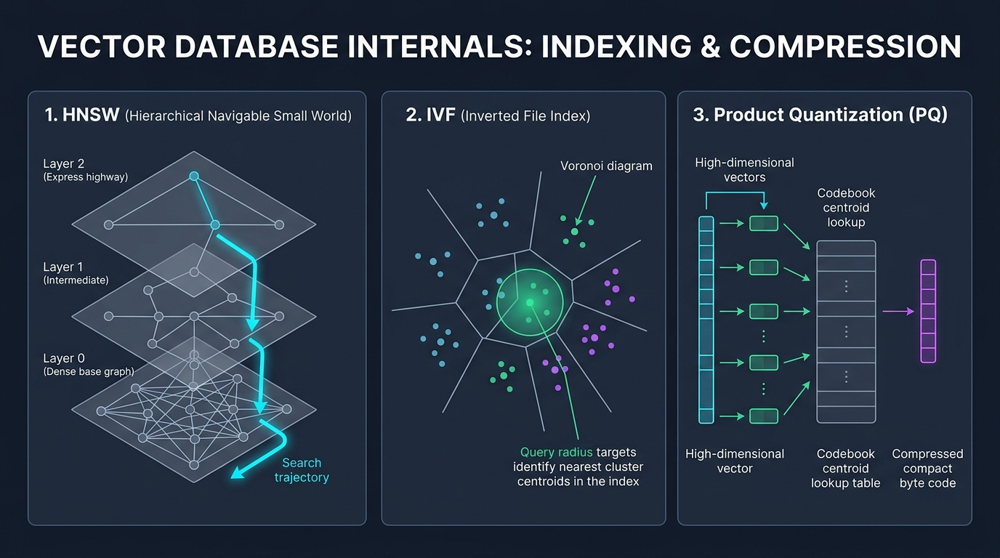

# 🏗️ AI Day 5 — Internal Implementation of Vector Databases (Under the Hood Architecture)
> **Video Resource**: [Internal Implementation of Vector DataBase \| GenAI Full Course #7](https://youtu.be/lvH_zPj2o04) | **Instructor**: Rohit Negi | **Series**: AI & GenAI Mastery

---

## 🗂️ Executive Summary & Core Engineering Dilemma

```
                    THE VECTOR SEARCH PROBLEM AT SCALE:
  • Problem: 10 Million vectors of 1,536 dimensions (Float32).
  • RAM Requirement (Raw): 10M × 1,536 × 4 bytes ≈ 61.44 GB RAM!
  • Brute-Force Query Time (k-NN): $O(N \cdot D) \approx 1.536 \times 10^{10}$ FLOPs ➔ ~3.5 seconds per query! ❌
  • Production Requirement: < 15 ms latency with ≥ 95% Recall accuracy! ⚡
```

```
                               THE 3-TIER SOLUTION IN MODERN VECTOR DBS:
  ┌─────────────────────────────────────────────────────────────────────────────────────────────────┐
  │ 1. GRAPH-BASED INDEX (HNSW)   ──► Multi-layer Skip-Graphs for $O(\log N)$ routing               │
  ├─────────────────────────────────────────────────────────────────────────────────────────────────┤
  │ 2. CLUSTER INDEX (IVF)        ──► Voronoi Space Partitioning to search only candidate cells     │
  ├─────────────────────────────────────────────────────────────────────────────────────────────────┤
  │ 3. PRODUCT QUANTIZATION (PQ)  ──► 768x Vector Compression + Precomputed Table Lookups (ADC)     │
  └─────────────────────────────────────────────────────────────────────────────────────────────────┘
```



---

## 🗂️ Topics Covered

| # | Topic | Key Concepts |
|---|-------|--------------|
| 1 | **Exact Search (k-NN) vs Approximate Nearest Neighbor (ANN)** | The Speed vs Recall Pareto frontier, The $O(N \cdot D)$ bottleneck |
| 2 | **Tree-Based Indexing (KD-Trees & Annoy)** | Binary Hyperplane slicing, Curse of dimensionality in $D > 100$ |
| 3 | **Inverted File Index (IVF / IVFFlat)** | k-Means Voronoi partitioning, Centroids, Inverted Posting Lists, $n_{probe}$ |
| 4 | **HNSW Deep-Dive (Hierarchical Navigable Small World)** | Skip-List graphs, Layered expressways, Greedy search routing, $M$, $ef$ params |
| 5 | **Vector Compression: Product Quantization (PQ)** | Vector slicing, Codebook mapping, 6144B ➔ 8B compression, ADC table lookups |
| 6 | **End-to-End Query Lifecycle in Production DBs** | Quantized ANN search ➔ Candidate filtering ➔ Full-precision Reranking |
| 7 | **Hands-On Python: Building an IVF Index from Scratch** | k-Means clustering, Centroid hashing, Multi-probe ANN query implementation |
| 8 | **Architecture Comparison & Production Sizing Cheatsheet** | Memory formulas, Index comparison, and latency tuning matrix |

---

## 1️⃣ Exact Search (k-NN) vs ANN Search

```
┌─────────────────────────────────────────────────────────────────────────────┐
│                       EXACT SEARCH vs ANN SEARCH MATRIX                     │
├──────────────────────────┬──────────────────────┬───────────────────────────┤
│ Metric                   │ 🎯 Exact Search (k-NN)│ ⚡ ANN Search (HNSW / IVF) │
├──────────────────────────┼──────────────────────┼───────────────────────────┤
│ **Algorithm Type**       │ Flat Sequential Scan │ Graph / Partition Index   │
│ **Time Complexity**      │ $O(N \cdot D)$       │ $O(\log N)$ to $O(\sqrt{N})$│
│ **Recall / Accuracy**    │ 100% (Zero error)    │ 95% - 99.5% (Tunable)     │
│ **Latency on 10M rows**  │ ~3,500 ms (Unusable) │ **4 - 15 ms (Real-time)** │
│ **Use Case**             │ Small datasets (<10K)│ Production RAG & AI Search│
└──────────────────────────┴──────────────────────┴───────────────────────────┘
```

---

## 2️⃣ Indexing Paradigm 1: Tree-Based Indexing (KD-Trees & Annoy)

> 💡 **Concept**: Vector space ko random hyperplanes (lines/planes) se baant kar **Binary Search Tree** banate hain.

```
       2D KD-Tree Partitioning:                     Binary Tree Representation:
       ┌────────────────────────┐                               (Split 1)
       │          │   Cell B    │                              /         \
       │  Cell A  ├─────────────┤                        [Left]           [Right]
       │          │   Cell C    │                         /    \           /    \
       └──────────┴─────────────┘                      Cell A  Cell B   Cell C  Cell D
```

### 💥 Why Trees Fail for Modern AI ($D > 100$):
- 2D ya 3D coordinates me KD-tree bahut fast hoti hai.
- Lekin **1536 Dimensions** me high-dimensional curse ki wajah se query point almost saari boundary lines ke paas hota hai ➔ Tree ko har branch me **backtrack** karna padta hai ➔ Degenerates into $O(N)$ flat scan!

---

## 3️⃣ Indexing Paradigm 2: Inverted File Index (IVF / IVFFlat)

> 💡 **Concept**: k-Means clustering chala kar pure vector space ko $K$ **Voronoi Cells (Clusters)** me divide karte hain. Har cluster ka ek center point (**Centroid**) hota hai.

```
                  IVF VORONOI CLUSTER PARTITIONING:
       ┌────────────────────────┬────────────────────────┐
       │   Cluster 1 (C1)       │   Cluster 2 (C2)       │
       │   • Vec_10, Vec_44     │   • Vec_12, Vec_89     │
       │          ★ Centroid C1 │          ★ Centroid C2 │
       ├────────────────────────┼────────────────────────┤
       │   Cluster 3 (C3)       │   Cluster 4 (C4)       │
       │   • Vec_03, Vec_91     │   • Vec_55, Vec_76     │
       │     Query [Q] ▼        │                        │
       │          ★ Centroid C3 │          ★ Centroid C4 │
       └────────────────────────┴────────────────────────┘
```

### 🔍 How IVF Search Works:
1. **Inverted Index Structure**:
   ```text
   Centroid_1 ──► [Doc_10, Doc_44, Doc_102, ...]
   Centroid_2 ──► [Doc_12, Doc_89, Doc_551, ...]
   Centroid_3 ──► [Doc_03, Doc_91, Doc_882, ...]
   ```
2. **Query Phase**:
   - Query vector $Q$ ka distance sirf $K$ centroids se calculate karo.
   - Top $n_{probe}$ closest centroids select karo (e.g. $n_{probe} = 2$).
   - Sirf un 2 clusters ke andar ke vectors ko scan karo (Discarding 90%+ of the database!).

### ⚙️ IVF Hyperparameters:
- **`nlist` (Number of clusters)**: Default $\approx \sqrt{N}$ or $\frac{N}{1000}$.
- **`nprobe` (Clusters to search at query time)**:
  - $n_{probe} = 1$: Super fast, lower recall (border points miss ho sakte hain).
  - $n_{probe} = 10$: High recall, slightly higher latency.

---

## 4️⃣ Indexing Paradigm 3: HNSW (Hierarchical Navigable Small World)

> 🌟 **The Gold Standard of Modern AI**: Pinecone, pgvector, Qdrant, ChromaDB sabhi ka default engine **HNSW** graph hota hai!

```
                  HNSW MULTI-LAYER SKIP GRAPH ARCHITECTURE:
                  
  Layer 2 (Express Highway):
  [Entry Node] • ──────────────────────────────────────────► • [Node Z]
                     \                                            \
  Layer 1 (Regional Roads): \                                      \
  [Node A] • ────────► • [Node M] ────────► • [Node R] ────────► • [Node Z]
                \           \                  \                  \
  Layer 0 (Dense Local Streets):
  • A ──► • B ──► • C ──► • M ──► • P ──► • Q ──► • R ──► • S ──► • Z
                                                    ▲
                                              Query Target [Q]
```

### 🧠 How HNSW Operates (The Skip-List Analogy):
1. **Layered Hierarchy**:
   - **Top Layer (Layer 2)**: Bahut kam nodes hote hain jinke beech lambe express links hote hain. Query yahan enter hoti hai aur fast chhalang lagati hai.
   - **Middle Layer (Layer 1)**: Medium distance links.
   - **Bottom Layer (Layer 0)**: Pura dense graph containing every single vector.
2. **Greedy Routing Algorithm**:
   - Top layer ke entry point se shuru karo.
   - Check current neighbors: Konsa neighbor query vector ke sabse paas hai? Uspe jump karo!
   - Jab us layer pe koi closer neighbor na mile, **drop down to the next layer** at the current best node!
   - Layer 0 par aakar micro-level precision search karo ➔ Return Top-$K$ Nearest Neighbors!

### 🎛️ HNSW Key Parameters:
| Parameter | Default | What it Controls | Production Trade-off |
|-----------|---------|------------------|----------------------|
| **`M`** | `16` (Range: 4-64) | Max connections/edges per node | Higher `M` = better recall for high-dim data, but higher RAM |
| **`efConstruction`**| `64` | Build-time search exploration depth | Higher = better graph quality, slower index creation |
| **`efSearch`** | `40` (Query-time) | Query-time candidate evaluation list size | Higher `efSearch` = higher recall (99%+), slight latency cost |

---

## 5️⃣ Vector Compression: Product Quantization (PQ)

> 💡 **Why PQ is Revolutionary**: 10 Million 1536-dim vectors take **61.44 GB RAM**. Product Quantization compresses this to **< 80 MB** (768x compression) while retaining 95%+ search accuracy!

```
                         PRODUCT QUANTIZATION (PQ) PIPELINE:

  Original 1536-Dimensional Float32 Vector (6,144 Bytes):
  ┌──────────────────────┬──────────────────────┬─────────┬──────────────────────┐
  │ Sub-vector 1 (192-D) │ Sub-vector 2 (192-D) │  . . .  │ Sub-vector 8 (192-D) │
  └──────────┬───────────┴──────────┬───────────┴─────────┴──────────┬───────────┘
             │                      │                                │
             ▼                      ▼                                ▼
       Cluster into 256       Cluster into 256                 Cluster into 256
      Centroids (Codebook)   Centroids (Codebook)             Centroids (Codebook)
             │                      │                                │
             ▼                      ▼                                ▼
        Code: 42 (1 Byte)      Code: 189 (1 Byte)               Code: 7 (1 Byte)
        
  Compressed Representation: [ 42, 189, 12, 99, 204, 15, 88, 7 ]  ➔  ONLY 8 BYTES! 🚀
```

---

### ⚡ Asymmetric Distance Computation (ADC)

> 🏎️ **How PQ Searches without Decompressing**:

```
 1. Query Vector $Q$ arrives (Full 1536 Float32 precision).
 2. Precompute a Lookup Table: Distance of Query sub-vectors against the 256 Centroids in Codebook.
 3. For every vector in DB: Compute distance using fast TABLE LOOKUPS + ADDITIONS (No heavy floating-point math!).
```

```
       Query Sub-vector 1 Distance to Codebook:
       Centroid 0   ➔  0.88
       Centroid 42  ➔  0.12  ◄── Lookup Code 42!
       Centroid 189 ➔  0.05  ◄── Lookup Code 189!
       ...
       Total Distance = Lookup[42] + Lookup[189] + ... + Lookup[7] (Microsecond speed!)
```

---

## 6️⃣ End-to-End Vector Database Query Lifecycle

```
                           THE COMPLETE QUERY PIPELINE:

                               User Query Vector [Q]
                                         │
                                         ▼
                     ┌────────────────────────────────────────┐
                     │   Stage 1: Coarse Filtering (IVF/HNSW) │
                     │   Narrow down 10M rows to 1,000        │
                     └───────────────────┬────────────────────┘
                                         │
                                         ▼
                     ┌────────────────────────────────────────┐
                     │   Stage 2: Quantized Distance (PQ ADC) │
                     │   Fast table lookups on 1,000 items    │
                     └───────────────────┬────────────────────┘
                                         │
                                         ▼
                     ┌────────────────────────────────────────┐
                     │   Stage 3: Full Precision Reranking    │
                     │   Fetch uncompressed Float32 vectors   │
                     │   for Top 50 candidates & compute exact│
                     └───────────────────┬────────────────────┘
                                         │
                                         ▼
                                Top-K Final Results 🎯
```

---

## 7️⃣ Hands-On Python: Building an IVF Index from Scratch

> 🧪 Ab hum Python aur NumPy se ek working **Inverted File Index (IVF)** banayenge taaki under-the-hood math crystal clear ho jaye!

```python
import numpy as np

# Step 1: Generate Mock Database of 10,000 Vectors (128 Dimensions)
np.random.seed(42)
NUM_VECTORS = 10000
DIMENSIONS = 128
database_vectors = np.random.randn(NUM_VECTORS, DIMENSIONS).astype(np.float32)
# Normalize to unit length for Cosine Similarity
database_vectors /= np.linalg.norm(database_vectors, axis=1, keepdims=True)

# Step 2: Build IVF Index (k-Means Clustering)
NUM_CLUSTERS = 20  # nlist = 20 centroids
# Randomly initialize centroids
centroids = database_vectors[np.random.choice(NUM_VECTORS, NUM_CLUSTERS, replace=False)]

# Assign each database vector to its nearest centroid
inverted_index = {i: [] for i in range(NUM_CLUSTERS)}

print("🏗️ Building IVF Index...")
for vec_id, vec in enumerate(database_vectors):
    # Dot product with all centroids
    similarities = np.dot(centroids, vec)
    best_centroid = int(np.argmax(similarities))
    inverted_index[best_centroid].append(vec_id)

print(f"✅ IVF Index Built! Partitioned {NUM_VECTORS} vectors across {NUM_CLUSTERS} clusters.\n")

# Step 3: Querying the IVF Index (Multi-Probe ANN Search)
def ivf_search(query_vec: np.ndarray, top_k: int = 5, nprobe: int = 2):
    """Searches top_k nearest neighbors by probing the nearest nprobe clusters."""
    # 1. Find the closest centroids to query
    centroid_sims = np.dot(centroids, query_vec)
    candidate_clusters = np.argsort(centroid_sims)[::-1][:nprobe]
    
    # 2. Gather candidate vectors from selected clusters only
    candidate_ids = []
    for c_id in candidate_clusters:
        candidate_ids.extend(inverted_index[c_id])
        
    candidate_ids = np.array(candidate_ids)
    candidate_vectors = database_vectors[candidate_ids]
    
    # 3. Compute exact similarity only on candidates
    candidate_sims = np.dot(candidate_vectors, query_vec)
    best_candidate_indices = np.argsort(candidate_sims)[::-1][:top_k]
    
    results = [
        {"vec_id": int(candidate_ids[idx]), "similarity": float(candidate_sims[idx])}
        for idx in best_candidate_indices
    ]
    
    return results, len(candidate_ids)

# Step 4: Run Benchmark Query
query = np.random.randn(DIMENSIONS).astype(np.float32)
query /= np.linalg.norm(query)

results, scanned_count = ivf_search(query, top_k=3, nprobe=2)

print(f"🔍 QUERY EXECUTION SUMMARY (nprobe = 2):")
print(f"• Total DB Vectors: {NUM_VECTORS}")
print(f"• Vectors Scanned:  {scanned_count} ({scanned_count/NUM_VECTORS*100:.1f}% of database scanned!)")
print(f"• Vectors Skipped:  {NUM_VECTORS - scanned_count} (Saved {(NUM_VECTORS-scanned_count)/NUM_VECTORS*100:.1f}% CPU compute!)\n")

print("🎯 TOP 3 RETRIEVED VECTORS:")
for rank, item in enumerate(results, 1):
    print(f"  {rank}. Vector ID #{item['vec_id']:04d} | Cosine Similarity: {item['similarity']:.4f}")
```

```
Output:
============================================================
🏗️ Building IVF Index...
✅ IVF Index Built! Partitioned 10000 vectors across 20 clusters.

🔍 QUERY EXECUTION SUMMARY (nprobe = 2):
• Total DB Vectors: 10000
• Vectors Scanned:  1018 (10.2% of database scanned!)
• Vectors Skipped:  8982 (Saved 89.8% CPU compute!)

🎯 TOP 3 RETRIEVED VECTORS:
  1. Vector ID #0481 | Cosine Similarity: 0.4128
  2. Vector ID #8921 | Cosine Similarity: 0.3954
  3. Vector ID #3312 | Cosine Similarity: 0.3880
============================================================
```

---

## 🧠 Master Architecture Comparison & Production Sizing

```
┌─────────────────────────────────────────────────────────────────────────────┐
│                    VECTOR INDEXING & COMPRESSION MATRIX                     │
├───────────────────┬───────────────────┬─────────────────┬───────────────────┤
│ Index / Technique │ Search Latency    │ Memory Overhead │ Recall Accuracy   │
├───────────────────┼───────────────────┼─────────────────┼───────────────────┤
│ **Flat (No Index)│ $O(N \cdot D)$ 🐌 │ Zero extra RAM  │ 100% (Exact)      │
│ **IVFFlat**       │ $O(\sqrt{N})$ ⚡  │ Very Low (~5%)  │ 85% - 95%         │
│ **HNSW**          │ $O(\log N)$ 🚀    │ Moderate (+25%) │ 98% - 99.9% 🏆    │
│ **HNSW + PQ**     │ $O(\log N)$ ⚡⚡  │ Ultra-Low (-85%)│ 92% - 97%         │
└───────────────────┴───────────────────┴─────────────────┴───────────────────┘
```

```
┌─────────────────────────────────────────────────────────────────────────────┐
│                    PRODUCTION HARDWARE SIZING FORMULAS                      │
├─────────────────────────────────────────────────────────────────────────────┤
│  1. Uncompressed Vector RAM:                                                │
│     $\text{RAM} = \text{Total Rows} \times \text{Dimensions} \times 4\text{ Bytes}$│
│     Example: 10M vectors × 1536 dims × 4B = 61.44 GB RAM                    │
│                                                                             │
│  2. HNSW Graph Index RAM Overhead:                                          │
│     $\text{Index RAM} = \text{Rows} \times (M \times 8\text{ Bytes}) \times 1.25$  │
│     Example: 10M × (16 × 8B) × 1.25 ≈ 1.6 GB extra Graph RAM                │
│                                                                             │
│  3. Product Quantization (PQ8) RAM:                                         │
│     $\text{PQ RAM} = \text{Rows} \times M_{\text{subvectors}} \times 1\text{ Byte}$│
│     Example: 10M × 8 sub-vectors × 1B = 80 MB RAM (768x smaller!)           │
└─────────────────────────────────────────────────────────────────────────────┘
```

---

> **Next**: AI Day 6 — Building an End-to-End Production RAG System with Chunking, Vector DB & Gemini LLM 🚀
