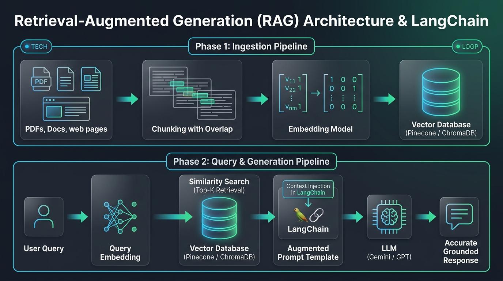

# 📚 AI Day 6 — Retrieval-Augmented Generation (RAG) & LangChain Master Guide
> **Video Resource**: [What is Retrieval Augmented Generation (RAG) \| What is LangChain \| GenAI Full Course #8](https://youtu.be/4Ax77tnW0e8) | **Instructor**: Rohit Negi | **Series**: AI & GenAI Mastery
> **Supporting Reference**: [RAG System Notion Documentation](https://certain-mechanic-42c.notion.site/RAG-System-23c3a78e0e22801caa04d16f95df1825)

---

## 🗂️ Executive Architecture Overview

```
                      ┌────────────────────────────────────────────────────────┐
                      │                 THE ESSENCE OF RAG                     │
                      ├────────────────────────────────────────────────────────┤
                      │  RAG = Retrieval (Search) + Augmentation (Context)     │
                      │        + Generation (LLM Synthesis)                    │
                      │                                                        │
                      │  "Stop forcing LLMs to memorize the world.             │
                      │   Give them an open book during the exam instead!" 📖  │
                      └────────────────────────────────────────────────────────┘
```

```
                              THE COMPLETE 2-PHASE RAG PIPELINE:

  ══════════════════════════════════════════════════════════════════════════════════
  PHASE 1: INGESTION PIPELINE (Offline / Batch Processing)
  ══════════════════════════════════════════════════════════════════════════════════
  [ Raw PDFs / Docs ] ──► [ Text Chunking (with Overlap) ] ──► [ Embedding Model ] ──► [ Vector DB (Pinecone) ]
  
  ══════════════════════════════════════════════════════════════════════════════════
  PHASE 2: RETRIEVAL & GENERATION PIPELINE (Online / Real-time User Query)
  ══════════════════════════════════════════════════════════════════════════════════
  User Question ("What is the refund policy?")
       │
       ▼
  Embedding Model ──► [ Query Vector ] ──► [ Vector DB Similarity Search ]
                                                    │
                                                    ▼ (Top 3 Relevant Chunks)
  Prompt Template:
  "Answer based ONLY on this context:
   [Context: Chunk 1 + Chunk 2 + Chunk 3]
   Question: What is the refund policy?"
       │
       ▼
  [ LLM Brain (Gemini / GPT-4o) ] ──► Grounded, Cited, 100% Fact-Checked Answer! 🎯
```



---

## 🗂️ Topics Covered

| # | Topic | Key Concepts |
|---|-------|--------------|
| 1 | **Why RAG? The 3 Great Limitations of LLMs** | Knowledge Cutoff, Private Enterprise Data, Hallucinations |
| 2 | **RAG vs Fine-Tuning: When to Use What?** | Knowledge injection vs Style/Format adaptation, Cost comparison |
| 3 | **The Ingestion Pipeline: Loading & Chunking** | Chunk Size, Chunk Overlap, RecursiveCharacterTextSplitter |
| 4 | **The Retrieval & Generation Pipeline** | Semantic Search, Top-$K$ retrieval, Prompt augmentation & Grounding |
| 5 | **What is LangChain? The Orchestration Engine** | Loaders, Splitters, Embeddings, VectorStores, LCEL Chains |
| 6 | **Hands-On Project: "Chat with Your PDF" in Python** | LangChain + Pinecone / ChromaDB + Google Gemini SDK |
| 7 | **The RAG Triad & Production Best Practices** | Context Relevance, Groundedness, Answer Relevance, Lost-in-the-Middle |
| 8 | **Architecture Cheatsheet & Mental Models** | Production sizing, Chunking formulas, and Interview takeaways |

---

## 1️⃣ Why RAG? The 3 Great Limitations of LLMs

```
┌─────────────────────────────────────────────────────────────────────────────┐
│                       THE 3 FUNDAMENTAL FLAWS OF RAW LLMs                   │
├──────────────────────────┬──────────────────────────────────────────────────┤
│ 1. Knowledge Cutoff      │ LLM training data is frozen in time. It has zero │
│                          │ knowledge of today's news, stocks, or events.    │
├──────────────────────────┼──────────────────────────────────────────────────┤
│ 2. Private Company Data  │ ChatGPT has never seen your company's internal   │
│                          │ Notion docs, employee handbooks, or codebase.    │
├──────────────────────────┼──────────────────────────────────────────────────┤
│ 3. Hallucinations 💊     │ When an LLM doesn't know a fact, it doesn't say  │
│                          │ "I don't know" — it hallucinates a plausible lie!│
└──────────────────────────┴──────────────────────────────────────────────────┘
```

> 💡 **The RAG Breakthrough**: Instead of relying on the LLM's parametric memory (weights), RAG fetches external factual source documents and feeds them directly into the LLM's prompt window.

---

## 2️⃣ RAG vs Fine-Tuning: When to Use What?

```
┌─────────────────────────────────────────────────────────────────────────────┐
│                         RAG vs FINE-TUNING DECISION MATRIX                  │
├──────────────────────────┬──────────────────────┬───────────────────────────┤
│ Parameter                │ 🔍 RAG (Retrieval)   │ 🎓 Fine-Tuning            │
├──────────────────────────┼──────────────────────┼───────────────────────────┤
│ **Primary Purpose**      │ Injecting Knowledge  │ Changing Style / Tone /   │
│                          │ (Facts, Documents)   │ Specific Domain Jargon    │
├──────────────────────────┼──────────────────────┼───────────────────────────┤
│ **Data Freshness**       │ ⚡ Instant (Just add │ ⏳ Slow (Requires full    │
│                          │ to Vector DB)        │ retraining cycle)         │
├──────────────────────────┼──────────────────────┼───────────────────────────┤
│ **Cost & Compute**       │ 💰 Low (Vector DB)   │ 💸 High (GPU training)    │
│ **Hallucination Risk**   │ 🛡️ Almost Zero (Cites│ ⚠️ Still Hallucinates     │
│                          │ actual source chunks)│ when uncertain            │
│ **Source Citations**     │ ✅ Yes (Page & File) │ ❌ No source citations    │
└──────────────────────────┴──────────────────────┴───────────────────────────┘
```

> 🎯 **Golden Rule**:
> - Want the model to **KNOW** new information? ➔ **Use RAG**.
> - Want the model to **BEHAVE** or **FORMAT** in a unique style (e.g. Legal brief syntax)? ➔ **Use Fine-Tuning**.

---

## 3️⃣ The Ingestion Pipeline: Loading & Chunking Strategies

> ⚠️ **Why Can't We Feed the Entire 500-Page PDF into LLM?**
> 1. **Token Limits & Cost**: Sending 500,000 tokens on every question will drain your API budget in minutes.
> 2. **Lost in the Middle**: LLMs struggle to recall specific facts hidden in massive 100-page prompt contexts.
> 3. **Search Granularity**: Finding the exact 2 relevant paragraphs produces 10x higher answer quality.

---

### ✂️ Chunk Size vs Chunk Overlap (The Overlap Magic)

```
  Raw Text: "...refund is processed within 7 business days. Products damaged during transit..."
                                         │
                        WITHOUT OVERLAP (Hard Cutoff):
  [ Chunk 1: "...refund is processed within 7" ] ➔ Cuts mid-sentence! Lost meaning! ❌
  [ Chunk 2: " business days. Products damaged..." ]
  
                        WITH CHUNK OVERLAP (Seamless Context):
  ┌──────────────────────────────────────────────┐
  │ Chunk 1: "...refund is processed within 7 business days." │
  └──────────────────────┬───────────────────────┘
                         │ 50-Token Overlap Area
                         ▼
  ┌──────────────────────────────────────────────┐
  │ Chunk 2: "7 business days. Products damaged during transit..." │
  └──────────────────────────────────────────────┘
```

### 📏 Production Chunking Rules:
- **`chunk_size`**: `500 - 1000 characters` (or ~150-250 tokens) — Perfect semantic paragraph size.
- **`chunk_overlap`**: `10% - 20%` (e.g., `100 characters` for a 500-char chunk) — Preserves context across chunk boundaries.
- **`RecursiveCharacterTextSplitter`**: Pehle double-newline `\n\n` (paragraphs) pe todta hai, phir single newline `\n`, phir space ` `, aur aakhir me characters pe.

---

## 4️⃣ What is LangChain? (The AI Orchestration Framework)

> 💡 **What is LangChain?** LangChain is the "Lego Kit" for building LLM applications. It provides standardized abstractions to connect Data Loaders, Text Splitters, Embedding Models, Vector Stores, and LLMs into automated pipelines.

```
                           LANGCHAIN CORE PRIMITIVES:
  ┌────────────────────────────────────────────────────────────────────────┐
  │  1. Document Loaders  ──► PyPDFLoader, TextLoader, DirectoryLoader     │
  │  2. Text Splitters    ──► RecursiveCharacterTextSplitter               │
  │  3. Embeddings        ──► GoogleGenerativeAIEmbeddings, OpenAIEmbeddings│
  │  4. Vector Stores     ──► Pinecone, Chroma, FAISS, pgvector            │
  │  5. Retrievers        ──► `vectorstore.as_retriever(k=3)`              │
  │  6. Chains (LCEL)     ──► `retriever | format_docs | prompt | llm`     │
  └────────────────────────────────────────────────────────────────────────┘
```

---

## 5️⃣ Hands-On Project: "Chat with Your PDF" from Scratch

> 🛠️ Complete end-to-end Python script using **LangChain + ChromaDB / Pinecone + Google Gemini**!

### 📦 Step 1: Install Dependencies & Setup `.env`
```bash
pip install langchain langchain-google-genai langchain-community chromadb pypdf python-dotenv
```

```env
GEMINI_API_KEY=your_gemini_api_key_here
```

---

### 💻 Step 2: Complete RAG Pipeline Implementation

```python
import os
from dotenv import load_dotenv

# LangChain Imports
from langchain_community.document_loaders import PyPDFLoader
from langchain_text_splitters import RecursiveCharacterTextSplitter
from langchain_google_genai import GoogleGenerativeAIEmbeddings, ChatGoogleGenerativeAI
from langchain_community.vectorstores import Chroma
from langchain_core.prompts import ChatPromptTemplate
from langchain_core.runnables import RunnablePassthrough
from langchain_core.output_parsers import StrOutputParser

load_dotenv()

# ==============================================================================
# 🚀 PHASE 1: INGESTION PIPELINE (Load, Chunk, Embed & Store)
# ==============================================================================

def ingest_document(pdf_path: str):
    print(f"📄 1. Loading PDF: {pdf_path}...")
    loader = PyPDFLoader(pdf_path)
    raw_documents = loader.load()
    print(f"   ➔ Loaded {len(raw_documents)} pages successfully.")

    # 2. Text Chunking with Overlap
    print("✂️ 2. Splitting text into semantic chunks...")
    text_splitter = RecursiveCharacterTextSplitter(
        chunk_size=600,       # 600 characters per chunk
        chunk_overlap=100,     # 100 characters overlap
        separators=["\n\n", "\n", " ", ""]
    )
    chunks = text_splitter.split_documents(raw_documents)
    print(f"   ➔ Created {len(chunks)} chunks from the document.")

    # 3. Embedding Model
    embeddings = GoogleGenerativeAIEmbeddings(
        model="models/text-embedding-004",
        google_api_key=os.getenv("GEMINI_API_KEY")
    )

    # 4. Store in Local Vector Database (ChromaDB)
    print("💾 3. Generating embeddings & indexing into ChromaDB...")
    vector_store = Chroma.from_documents(
        documents=chunks,
        embedding=embeddings,
        persist_directory="./chroma_db"
    )
    print("✅ Ingestion Complete! Vector database is ready.\n")
    return vector_store


# ==============================================================================
# 🎯 PHASE 2: RETRIEVAL & GENERATION PIPELINE (Query & Answer)
# ==============================================================================

def build_rag_chain(vector_store):
    # 1. Setup Retriever (Fetch Top 3 most relevant chunks)
    retriever = vector_store.as_retriever(search_kwargs={"k": 3})

    # 2. LLM Generator
    llm = ChatGoogleGenerativeAI(
        model="gemini-2.5-flash",
        temperature=0.0, # Zero temperature prevents hallucinations
        google_api_key=os.getenv("GEMINI_API_KEY")
    )

    # 3. Grounded Prompt Template
    template = """You are a helpful, professional AI Assistant.
Answer the user's question using ONLY the provided context below.
If the answer cannot be found in the context, truthfully say: "I do not have enough information in the provided document to answer this question."
Do NOT make up or hallucinate any facts.

Context:
{context}

Question:
{question}

Helpful Answer:"""

    prompt = ChatPromptTemplate.from_template(template)

    # 4. Helper function to format retrieved chunks
    def format_docs(docs):
        return "\n\n---\n\n".join([doc.page_content for doc in docs])

    # 5. Build LCEL (LangChain Expression Language) Chain
    rag_chain = (
        {"context": retriever | format_docs, "question": RunnablePassthrough()}
        | prompt
        | llm
        | StrOutputParser()
    )

    return rag_chain


# ==============================================================================
# 🎮 INTERACTIVE TESTING LOOP
# ==============================================================================

if __name__ == "__main__":
    # Ingest a sample PDF document (e.g. Company Policy, Course Syllabus, etc.)
    # vector_db = ingest_document("company_handbook.pdf")
    
    # Or load existing Chroma vector store
    embeddings = GoogleGenerativeAIEmbeddings(
        model="models/text-embedding-004",
        google_api_key=os.getenv("GEMINI_API_KEY")
    )
    vector_db = Chroma(persist_directory="./chroma_db", embedding_function=embeddings)
    
    rag_system = build_rag_chain(vector_db)
    
    print("=" * 65)
    print("🤖 RAG 'CHAT WITH YOUR PDF' SYSTEM READY!")
    print("=" * 65)
    
    while True:
        query = input("\n👤 Ask a question (or 'exit' to quit): ")
        if query.lower() in ["exit", "quit", "q"]:
            break
            
        print("\n🔍 Retrieving chunks & generating grounded answer...")
        response = rag_system.invoke(query)
        print(f"\n🎯 AI Response:\n{response}")
```

---

## 6️⃣ The RAG Triad & Production Evaluation

Production RAG systems ko evaluate karne ke liye **3 Key Metrics (The RAG Triad)** use kiye jaate hain:

```
                            THE RAG TRIAD:
                            
                        User Question
                       /             \
                      /               \
         [ Context Relevance ]    [ Answer Relevance ]
                    /                   \
                   ▼                     ▼
          Retrieved Context ────────► Generated Answer
                     [ Groundedness / Faithfulness ]
```

1. **Context Relevance**: Kya Vector DB ne sach me question ke related chunks retrieve kiye?
2. **Groundedness (Faithfulness)**: Kya LLM ka answer 100% retrieved context par based hai (Zero Hallucination)?
3. **Answer Relevance**: Kya LLM ne actually user ke question ka seedha jawab diya?

---

## 🧠 Master RAG Cheatsheet & Interview Takeaways

```
┌─────────────────────────────────────────────────────────────────────────────┐
│                         PRODUCTION RAG CHEATSHEET                           │
├─────────────────────────────────────────────────────────────────────────────┤
│  1. RAG = Retrieval (Vector DB) + Augmentation (Context) + Generation (LLM) │
│                                                                             │
│  2. CHUNKING RULE:                                                          │
│     • Chunk Size = 500-1000 chars                                           │
│     • Chunk Overlap = 10-20% (Prevents lost context at borders)             │
│                                                                             │
│  3. HALLUCINATION PREVENTION:                                               │
│     • System Prompt: "Answer ONLY using the provided context."              │
│     • Temperature = 0.0 (Deterministic, strict adherence to facts)          │
│                                                                             │
│  4. LANGCHAIN PIPELINE (LCEL):                                              │
│     `chain = ({"context": retriever, "question": passthrough} | prompt | llm)`│
│                                                                             │
│  5. RAG vs FINE-TUNING:                                                     │
│     • New Facts & Documents ➔ RAG                                           │
│     • New Style, Syntax & Tone ➔ Fine-Tuning                                │
└─────────────────────────────────────────────────────────────────────────────┘
```

---

> **Next**: AI Day 7 — Advanced RAG Patterns: Multi-Query, HyDE, Self-Querying & Re-Ranking Systems 🚀
